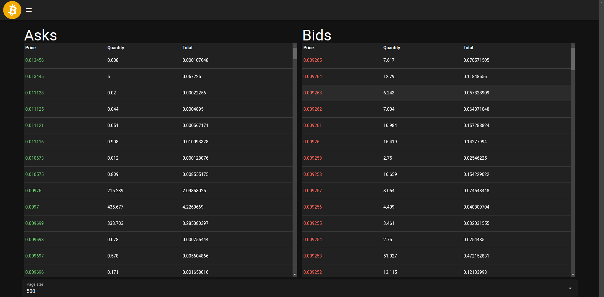

# Order table

The Order table app is capable of displaying the current exchange rate of currency pairs of popular cryptocurrencies.


## Project setup

Installing dependencies:
```
npm install
```

Before running the project, you need to generate an api schema.
```shell
npm run generate-api
```

## Starting project
To start the development server with hot-reload, run the following command. The server will be accessible at [http://localhost:3000](http://localhost:3000):

```shell
npm run dev
```

### Building for Production

To build your project for production, use:

```shell
npm run build
```